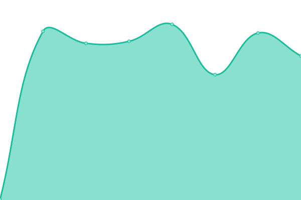
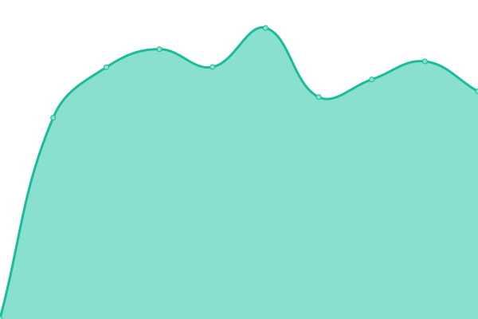
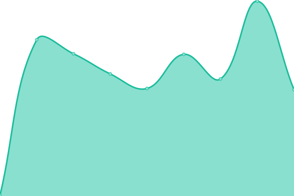
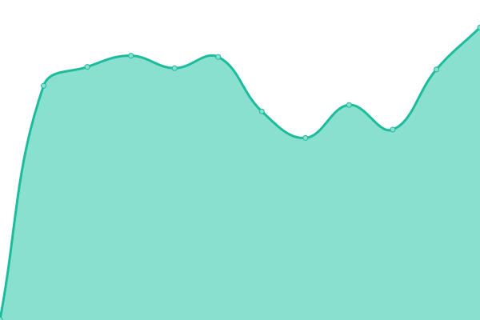
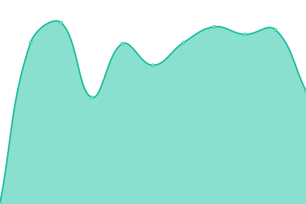
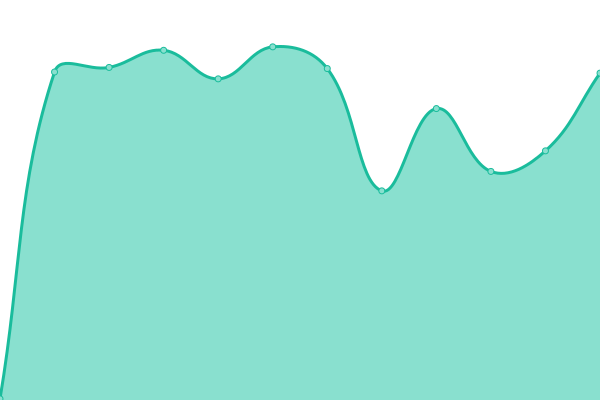

# [📈 Live Status](https://status.cxe.my.id): <!--live status--> **🟥 Complete outage**

This repository contains the open-source uptime monitor and status page for [CXE Nodes](https://status.cxe.my.id), powered by [Upptime](https://github.com/upptime/upptime).

With [Upptime](https://upptime.js.org), you can get your own unlimited and free uptime monitor and status page, powered entirely by a GitHub repository. We use [Issues](https://github.com/cxe-development-team/status-page/issues) as incident reports, [Actions](https://github.com/cxe-development-team/status-page/actions) as uptime monitors, and [Pages](https://status.cxe.my.id) for the status page.

<!--start: status pages-->
<!-- This summary is generated by Upptime (https://github.com/upptime/upptime) -->
<!-- Do not edit this manually, your changes will be overwritten -->
<!-- prettier-ignore -->
| URL | Status | History | Response Time | Uptime |
| --- | ------ | ------- | ------------- | ------ |
|  [Dashboard](https://dash.cxe.my.id/) | 🟥 Down | [dashboard.yml](https://github.com/CXE-Development-Team/status-page/commits/HEAD/history/dashboard.yml) | 

 1089ms
     
 | 

<a href="https://status.cxe.my.id/history/dashboard">68.50%</a>
    

|  [Free - Panel](https://portal.cxe.my.id/) | 🟥 Down | [free-panel.yml](https://github.com/CXE-Development-Team/status-page/commits/HEAD/history/free-panel.yml) | 

 947ms
     
 | 

<a href="https://status.cxe.my.id/history/free-panel">68.51%</a>
    

|  [Free - Node SG 2](free-sg2.cxe.my.id) | 🟥 Down | [free-node-sg-2.yml](https://github.com/CXE-Development-Team/status-page/commits/HEAD/history/free-node-sg-2.yml) | 

 0ms
     
 | 

<a href="https://status.cxe.my.id/history/free-node-sg-2">0.00%</a>
    

|  [Paid (new) - Node SG 2](paid-sg2.cxe.my.id) | 🟥 Down | [paid-new-node-sg-2.yml](https://github.com/CXE-Development-Team/status-page/commits/HEAD/history/paid-new-node-sg-2.yml) | 

 0ms
     
 | 

<a href="https://status.cxe.my.id/history/paid-new-node-sg-2">0.00%</a>
    

|  [Paid - Panel](https://panelcxe.hexagonn.my.id/) | 🟥 Down | [paid-panel.yml](https://github.com/CXE-Development-Team/status-page/commits/HEAD/history/paid-panel.yml) | 

 0ms
     
 | 

<a href="https://status.cxe.my.id/history/paid-panel">0.00%</a>
    

|  [Paid - Node SG 1](sgp1.hexagonn.my.id) | 🟥 Down | [paid-node-sg-1.yml](https://github.com/CXE-Development-Team/status-page/commits/HEAD/history/paid-node-sg-1.yml) | 

 0ms
     
 | 

<a href="https://status.cxe.my.id/history/paid-node-sg-1">0.00%</a>
    

|  [Paid - Node SG 2](sgp2.hexagonn.my.id) | 🟥 Down | [paid-node-sg-2.yml](https://github.com/CXE-Development-Team/status-page/commits/HEAD/history/paid-node-sg-2.yml) | 

 0ms
     
 | 

<a href="https://status.cxe.my.id/history/paid-node-sg-2">0.00%</a>
    

<!--end: status pages-->

[**Visit our status website →**](https://status.cxe.my.id)

## 📄 License

- Powered by: [Upptime](https://github.com/upptime/upptime)
- Code: [MIT](./LICENSE) © [CXE Nodes](https://status.cxe.my.id)
- Data in the `./history` directory: [Open Database License](https://opendatacommons.org/licenses/odbl/1-0/)
